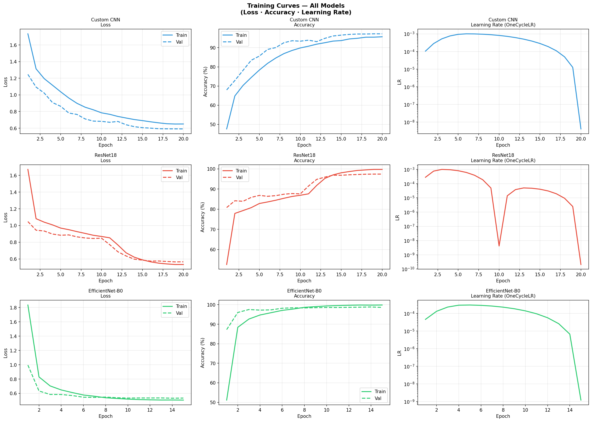
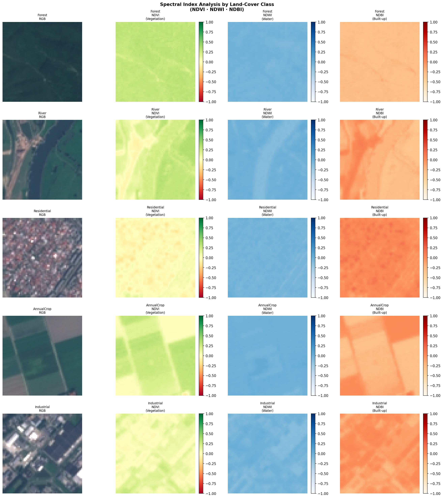
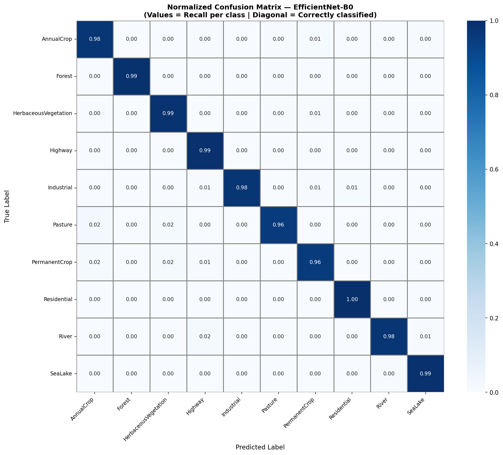
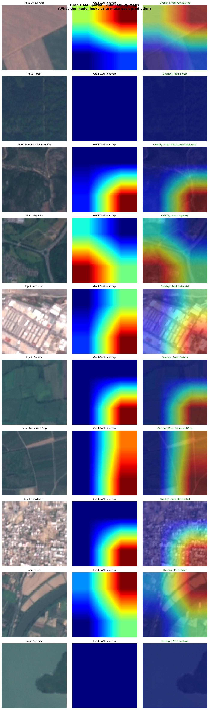
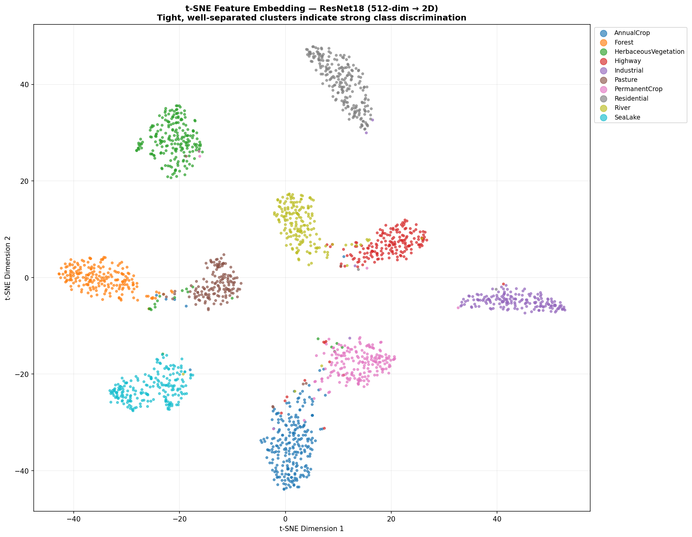

# 🛰️ Satellite Image Land-Cover Classification
### ISRO-Grade Deep Learning Pipeline | EuroSAT Dataset


---

## 📋 Overview

A production-grade deep learning pipeline for classifying satellite imagery into **10 land-cover categories** using the EuroSAT benchmark dataset (Sentinel-2 derived, 27,000 images at ~10m/pixel resolution).

This project is directly aligned with **ISRO's NRSC and Bhuvan** Earth Observation workflows — covering crop mapping, water body extraction, urban sprawl monitoring, and forest cover assessment using Resourcesat-2/2A analogous data.

---

## 🏆 Results

| Model | Overall Accuracy | Cohen's Kappa (κ) | Macro F1 | Mean IoU | Params |
|---|---|---|---|---|---|
| Custom CNN | 96.44% | 0.9604 | 96.38% | 93.07% | 0.32M |
| ResNet18 | 97.48% | 0.9720 | 97.40% | 94.96% | 11.31M |
| **EfficientNet-B0** | **98.20%** | **0.9799** | **98.14%** | **96.37%** | 4.34M |

> Cohen's Kappa of **0.9799** is rated *Excellent* (≥0.8) — publication-level performance on a 10-class remote sensing benchmark.

---

## 🗂️ Dataset — EuroSAT

| Class | Images | ISRO Application |
|---|---|---|
| AnnualCrop | 3,000 | Kharif/Rabi crop mapping |
| Forest | 3,000 | Forest Survey of India support |
| HerbaceousVegetation | 3,000 | Grassland / scrub monitoring |
| Highway | 2,500 | Linear infrastructure detection |
| Industrial | 2,500 | Urban sprawl & land-use change |
| Pasture | 2,000 | Livestock zone classification |
| PermanentCrop | 2,500 | Orchard / plantation mapping |
| Residential | 3,000 | Settlement density analysis |
| River | 2,500 | Hydrological network mapping |
| SeaLake | 3,000 | Water body delineation (Bhuvan) |

---

## ✨ Key Features

- **Multi-Model Benchmarking** — Custom CNN vs ResNet18 vs EfficientNet-B0
- **Spectral Index Analysis** — NDVI, NDWI, NDBI computed and visualized per class
- **Grad-CAM Explainability** — Spatial heatmaps showing what the model focuses on
- **t-SNE Feature Embeddings** — 512-dim feature space projected to 2D
- **Advanced Training Pipeline** — OneCycleLR scheduler, early stopping, label smoothing, gradient clipping
- **Progressive Layer Unfreezing** — 2-phase fine-tuning for transfer learning models
- **ONNX Export** — Model exported for edge deployment on ISRO ground systems
- **Full Evaluation Suite** — OA, Kappa, IoU, F1, confusion matrix, error analysis

---

## 🏗️ Project Structure

```
satellite-landcover-classification/
│
├── ISRO_Satellite_LandCover_Classification.ipynb   ← Main notebook
├── README.md
└── requirements.txt
```

---

## 🚀 Getting Started

### Option 1 — Google Colab (Recommended)
Click below to open directly in Colab with free GPU:

[](https://colab.research.google.com/)

> Upload the `.ipynb` file → Runtime → Change runtime type → **T4 GPU** → Run All

### Option 2 — Local Setup

```bash
git clone https://github.com/YOUR_USERNAME/satellite-landcover-classification.git
cd satellite-landcover-classification
pip install -r requirements.txt
jupyter notebook ISRO_Satellite_LandCover_Classification.ipynb
```

---

## 📦 Requirements

```
torch>=2.0.0
torchvision>=0.15.0
scikit-learn>=1.2.0
matplotlib>=3.7.0
seaborn>=0.12.0
Pillow>=9.5.0
numpy>=1.24.0
```

---

## 📊 Sample Outputs

### Training Curves


### Spectral Index Analysis (NDVI / NDWI / NDBI)


### Confusion Matrix


### Grad-CAM Spatial Explainability

> The model correctly focuses on water pixels for River class, vegetation texture for Forest, and building density for Residential — geographically interpretable predictions.

### t-SNE Feature Embedding

> Well-separated clusters in 2D space confirm the model has learned discriminative spectral and spatial features for all 10 land-cover classes.

### Most Confused Class Pairs
| True Class | Predicted As | Reason |
|---|---|---|
| PermanentCrop | HerbaceousVegetation | Spectrally similar green cover |
| River | Highway | Both narrow linear features |
| Pasture | AnnualCrop | Similar texture patterns |

> These confusions mirror real challenges faced by human analysts in LULC mapping — validating the model's realism.
---

## 🔬 Future Work

- [ ] Extend to full **9-band Sentinel-2** multispectral input (direct Resourcesat LISS-III analogue)
- [ ] Implement **Vision Transformer (ViT)** encoder for global spatial context
- [ ] **SAR + Optical fusion** for all-weather land-cover classification
- [ ] Deploy as **Flask/FastAPI microservice** integrated with Bhuvan API
- [ ] Evaluate on **ISRO's NRSC open datasets** (Bhuvan LULC 2019)

---


*Developed as part of a deep learning research initiative aligned with ISRO's Earth Observation and remote sensing mission objectives.*
